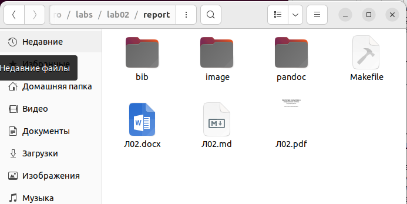
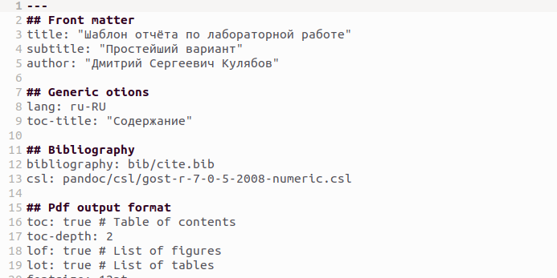
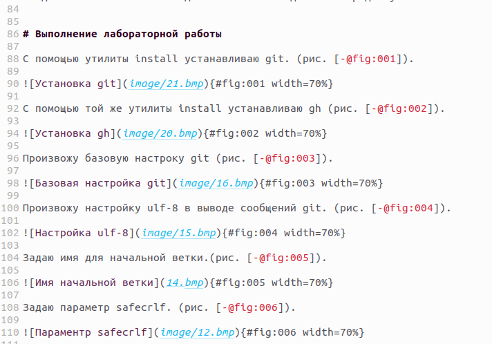
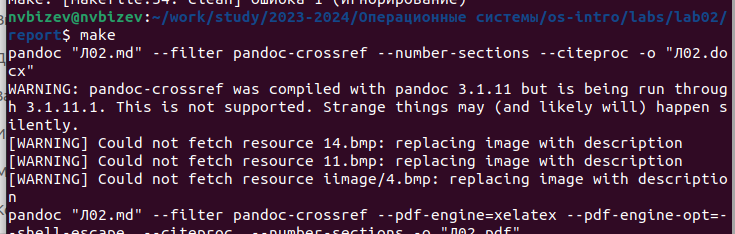
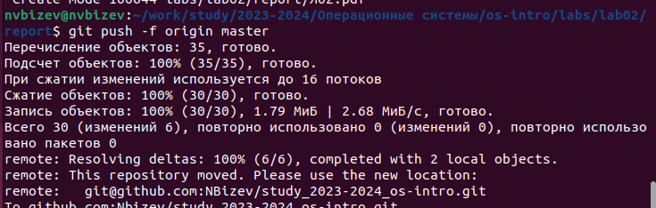

---
## Front matter
lang: ru-RU
title: Архитектура компьютеров и операционные системы
subtitle: Лабораторная работа №3
author:
  - Бизев Н.В 
  - 1132230806
institute:
  - Российский университет дружбы народов, Москва, Россия
date: 01 марта 2024

## i18n babel
babel-lang: russian
babel-otherlangs: english

## Formatting pdf
toc: false
toc-title: Содержание
slide_level: 2
aspectratio: 169
section-titles: true
theme: metropolis
header-includes:
 - \metroset{progressbar=frametitle,sectionpage=progressbar,numbering=fraction}
 - '\makeatletter'
 - '\beamer@ignorenonframefalse'
 - '\makeatother'
---

# Вводная часть

## Объект и предмет исследования

- Язык разметки Markdown

## Цели и задачи

- Цель данной лабораторной работы - научиться оформлять отчёты с помощью легковесного языка разметки Markdown.

## Выполнение лабораторной работы

# Шаг 1

- Перехожу в каталог, в котором находится шаблон для отчета по лабораторной работе. (рис.1).

{#fig:001 width=70%}

# Шаг 2

- Открываю файл с помощью текстого редактора. (рис.2).

{#fig:002 width=70%}

# Шаг 3

- Заполняю файл придерживаясь языковой разметки Markdown. (рис.3).

{#fig:003 width=70%}

# Шаг 4

- Выполняю копмпиляцию файла в pdf и docx с помощью make. (рис.4).

{#fig:004 width=70%}

# Шаг 5

- С помощью git push отправляю файлы в глобальный репозиторий. (рис.5).

{#fig:005 width=70%}

# Выводы

- При выполнении лабораторной работы №3 я приобрел необходимые навыки
для работы с языком разметки Markdown.

:::

